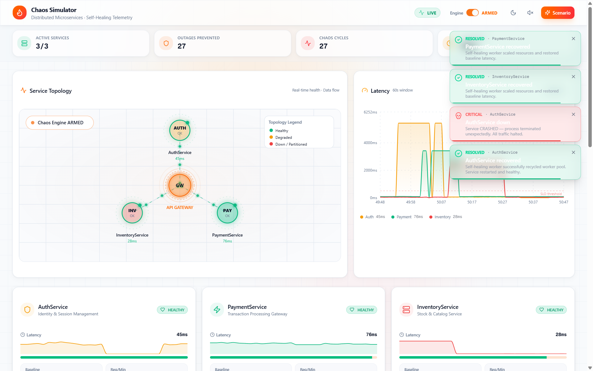
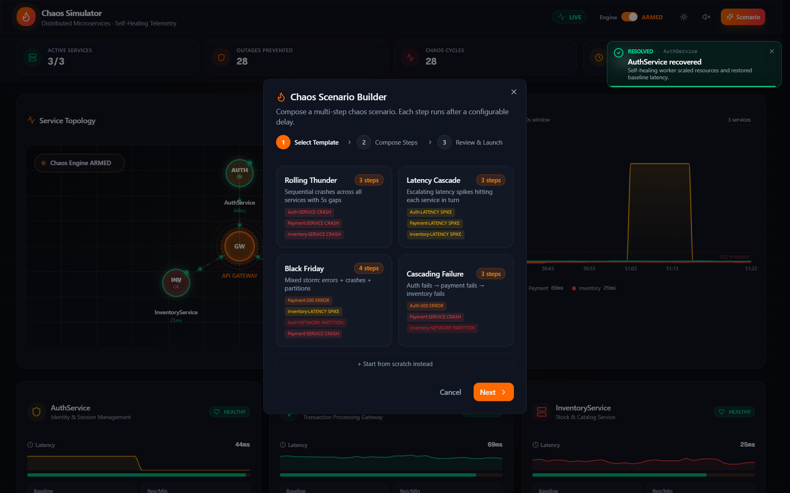
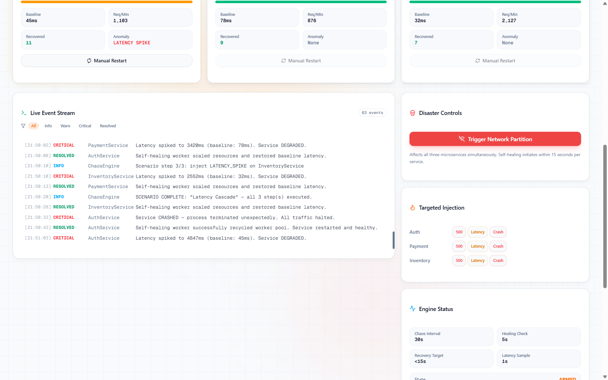
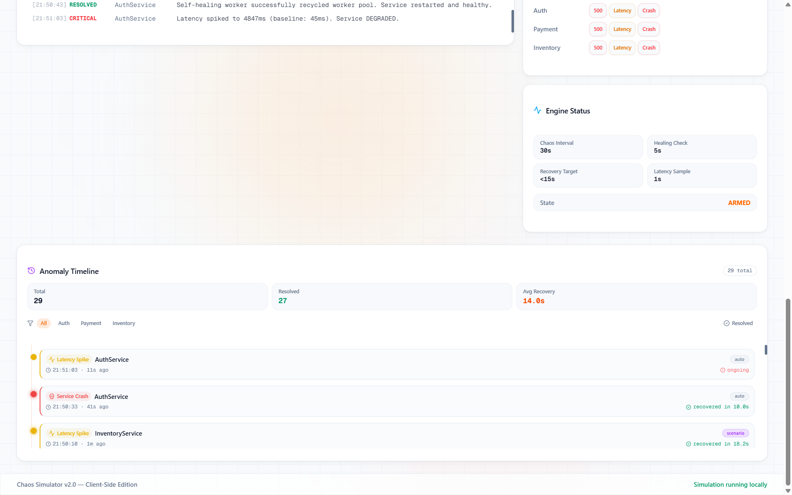

# 🔲 Chaos Simulator

Real-time chaos engineering dashboard with self-healing microservices, animated SVG topology, particle effects, scenario builder, and live WebSocket telemetry.

[](https://chaos-simulator-telemetry.vercel.app)
[](https://nextjs.org/)
[](https://www.typescriptlang.org/)
[](https://bun.sh/)
[](https://socket.io/)
[](https://tailwindcss.com/)
[](https://www.framer.com/motion/)
[](https://recharts.org/)
[](LICENSE)

---

## Live Demo

**https://chaos-simulator-telemetry.vercel.app**

> **Current status:** The live site runs a full **client-side simulation** (no backend required). Chaos injection, self-healing, scenarios, latency charts, and event stream all work in the browser. The real Bun + Socket.io engine is available for local development only.

---

## Screenshots

### Dashboard Overview


### Chaos Scenario Builder


### Live Controls & Event Stream


### Anomaly Timeline


---

## Features

- **3 mock microservices** (Auth, Payment, Inventory) with live health, latency, and request volume
- **Automated chaos injector** — 500 errors, latency spikes, and service crashes every 30 s
- **Self-healing recovery** — services restore themselves within 8–15 seconds
- **Animated SVG topology** with particle data flow and health-based pulse rings
- **Canvas particle bursts + synthesized sound** on every critical event
- **Multi-step Scenario Builder** with presets (Black Friday, Cascading Failure, etc.)
- **Real-time latency chart** (60 s window) and filterable anomaly timeline
- **Manual injection controls** and massive network-partition button

---

## Tech Stack

| Layer        | Technology                          |
|--------------|-------------------------------------|
| Frontend     | Next.js 16, React 19, TypeScript, Tailwind 4, shadcn/ui |
| Animation    | Framer Motion 12, Canvas particles  |
| Charts       | Recharts                            |
| Realtime     | Socket.io 4 (client + server) — local engine |
| Demo mode    | Pure client-side simulation (Vercel) |
| Backend      | Bun + Node http server (local only) |
| Package mgr  | Bun                                 |

---

## Architecture

**Public live demo (Vercel)** uses a complete client-side chaos engine (`useChaosEngine`). No paid backend is required.

**Local development** can also run the real Bun + Socket.io engine in `mini-services/chaos-engine` for a true multi-process setup.

```
Vercel / Demo mode          Local Live mode
┌───────────────────┐     ┌───────────────────┐     ┌───────────────────────────┐
│  Next.js Dashboard   │     │  Next.js Dashboard   │◀───■│  Chaos Engine (Bun)     │
│  + useChaosEngine    │     │  (Socket.io client)   │ WSS  │  + 3 mock services      │
│  (client simulation) │     └───────────────────┘     └───────────────────────────┘
└───────────────────┘
```

A short video walkthrough of the local Bun engine will be added to this README once recorded.

---

## Quick Start (local — client-side demo)

```bash
bun install
bun run dev
```

Open **http://localhost:3000**. The dashboard runs the full client-side simulation immediately.

---

## Quick Start (local — real Bun engine)

```bash
# Terminal 1 — chaos engine
cd mini-services/chaos-engine
bun install
bun index.ts

# Terminal 2 — dashboard (after wiring socket path)
cd ../..
bun run dev
```

---

## License

MIT License. See [LICENSE](LICENSE) for details.
